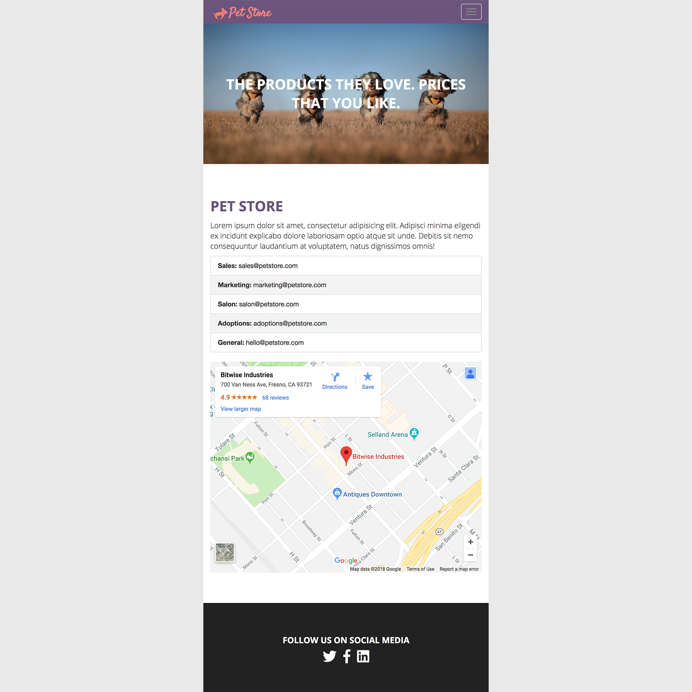

# petstore-2018-solution
The completed code for the petstore 2018 assignment
https://github.com/GeekwiseB2/petstore-2018-boilerplate

Part 2 Solution

## This is how mine looks based on my styles i've created on medium and large screens
<figure>
    
</figure>

## This is how mine looks based on my styles i've created on extra-small and small screens
<figure>
    
</figure>
